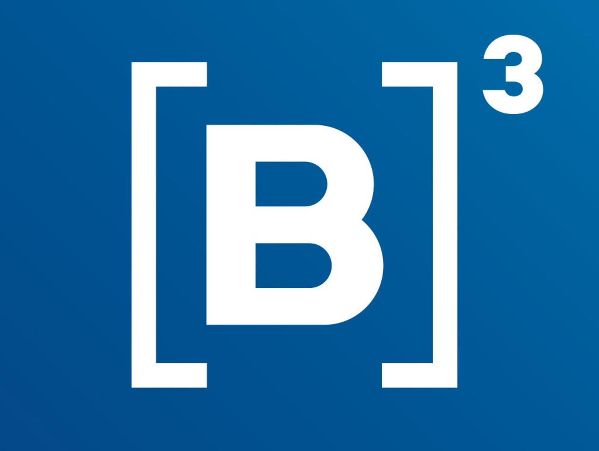

# { width="50" }      **B3 | Bolsa de valores**

## **Projeto EDC On-premisse**
O processo construído se trata da exportação automática de arquivos .PDM a partir do PowerDesigner. Com base no nome dos arquivos, a base EDC é enriquecida via API, catalogando os respectivos ativos apresentados no “Arquivo.PDM”.

#### Organograma do Projeto
Lorem ipsum dolor sit amet. Est cumque vero non voluptatem ullam qui quae quaerat aut dolor adipisci. Cum vitae porro et officia perspiciatis et molestiae magni ut corrupti unde ea magnam quos.

#### Matriz RACI
Lorem ipsum dolor sit amet. Est cumque vero non voluptatem ullam qui quae quaerat aut dolor adipisci. Cum vitae porro et officia perspiciatis et molestiae magni ut corrupti unde ea magnam quos.

#### Principais indicadores
Lorem ipsum dolor sit amet. Est cumque vero non voluptatem ullam qui quae quaerat aut dolor adipisci. Cum vitae porro et officia perspiciatis et molestiae magni ut corrupti unde ea magnam quos.

